# 10 | Dasar State Management
**Nama : Andreagazy Iza Anmerianto**
**NIM : 2241720146**
**Kelas : TI-3A/03**

## Praktikum 1: Dasar State dengan Model-View

### Langkah 1: Buat Project Baru
Buatlah sebuah project flutter baru dengan nama master_plan di folder src week-10 repository GitHub Anda atau sesuai style laporan praktikum yang telah disepakati. Lalu buatlah susunan folder dalam project seperti gambar berikut ini.

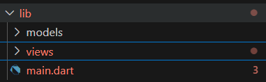

### Langkah 2: Membuat model task.dart
Praktik terbaik untuk memulai adalah pada lapisan data (data layer). Ini akan memberi Anda gambaran yang jelas tentang aplikasi Anda, tanpa masuk ke detail antarmuka pengguna Anda. Di folder model, buat file bernama task.dart dan buat class Task. Class ini memiliki atribut description dengan tipe data String dan complete dengan tipe data Boolean, serta ada konstruktor. Kelas ini akan menyimpan data tugas untuk aplikasi kita. Tambahkan kode berikut:

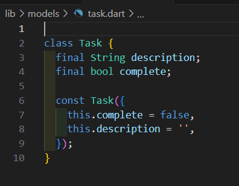


### Langkah 3: Buat file plan.dart
Kita juga perlu sebuah List untuk menyimpan daftar rencana dalam aplikasi to-do ini. Buat file plan.dart di dalam folder models dan isi kode seperti berikut.

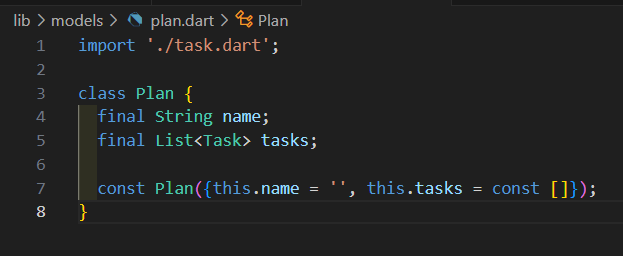

### Langkah 4: Buat file data_layer.dart
Kita dapat membungkus beberapa data layer ke dalam sebuah file yang nanti akan mengekspor kedua model tersebut. Dengan begitu, proses impor akan lebih ringkas seiring berkembangnya aplikasi. Buat file bernama data_layer.dart di folder models. Kodenya hanya berisi export seperti berikut.

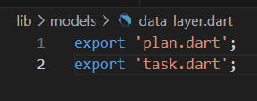

### Langkah 5: Pindah ke file main.dart
Ubah isi kode main.dart sebagai berikut.

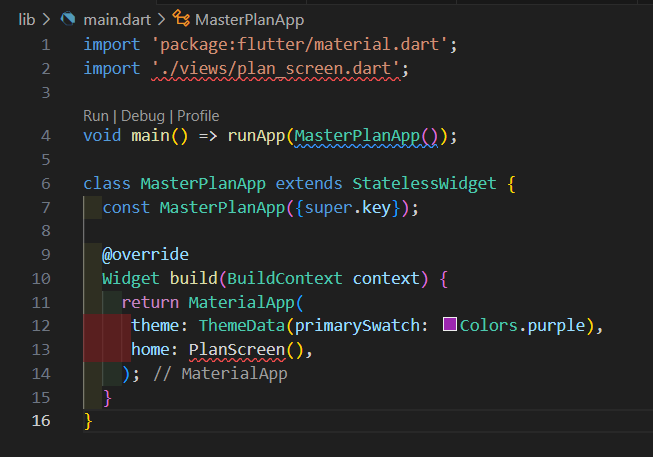

### Langkah 6: buat plan_screen.dart
Pada folder views, buatlah sebuah file plan_screen.dart dan gunakan templat StatefulWidget untuk membuat class PlanScreen. Isi kodenya adalah sebagai berikut. Gantilah teks ‘Namaku' dengan nama panggilan Anda pada title AppBar. 

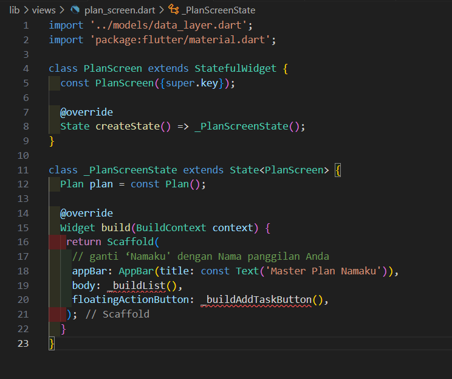

### Langkah 7: buat method _buildAddTaskButton()
Anda akan melihat beberapa error di langkah 6, karena method yang belum dibuat. Ayo kita buat mulai dari yang paling mudah yaitu tombol Tambah Rencana. Tambah kode berikut di bawah method build di dalam class _PlanScreenState.

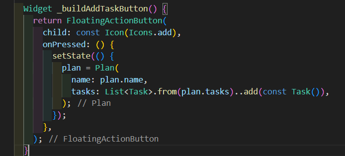

### Langkah 8: buat widget _buildList()
Kita akan buat widget berupa List yang dapat dilakukan scroll, yaitu ListView.builder. Buat widget ListView seperti kode berikut ini.

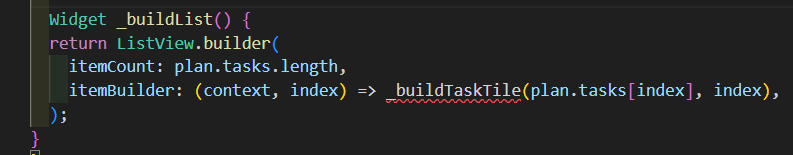

### Langkah 9: buat widget _buildTaskTile
Dari langkah 8, kita butuh ListTile untuk menampilkan setiap nilai dari plan.tasks. Kita buat dinamis untuk setiap index data, sehingga membuat view menjadi lebih mudah. Tambahkan kode berikut ini.

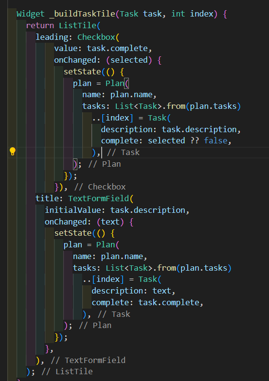

### Langkah 10: Tambah Scroll Controller
Anda dapat menambah tugas sebanyak-banyaknya, menandainya jika sudah beres, dan melakukan scroll jika sudah semakin banyak isinya. Namun, ada salah satu fitur tertentu di iOS perlu kita tambahkan. Ketika keyboard tampil, Anda akan kesulitan untuk mengisi yang paling bawah. Untuk mengatasi itu, Anda dapat menggunakan ScrollController untuk menghapus focus dari semua TextField selama event scroll dilakukan. Pada file plan_screen.dart, tambahkan variabel scroll controller di class State tepat setelah variabel plan.

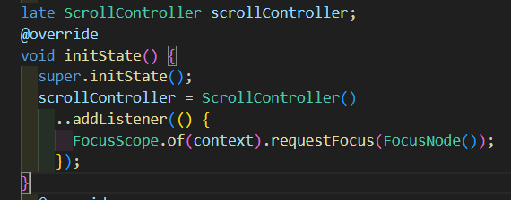

### Langkah 11: Tambah Scroll Listener
Tambahkan method initState() setelah deklarasi variabel scrollController seperti kode berikut.


### Langkah 12: Tambah controller dan keyboard behavior
Tambahkan controller dan keyboard behavior pada ListView di method _buildList seperti kode berikut ini.

```dart
return ListView.builder(
  controller: scrollController,
 keyboardDismissBehavior: Theme.of(context).platform ==
 TargetPlatform.iOS
          ? ScrollViewKeyboardDismissBehavior.onDrag
          : ScrollViewKeyboardDismissBehavior.manual,
```

### Langkah 13: Terakhir, tambah method dispose()
Terakhir, tambahkan method dispose() berguna ketika widget sudah tidak digunakan lagi.

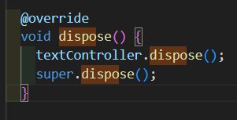

### Langkah 14: Hasil
Lakukan Hot restart (bukan hot reload) pada aplikasi Flutter Anda. Anda akan melihat tampilan akhir seperti gambar berikut. Jika masih terdapat error, silakan diperbaiki hingga bisa running.
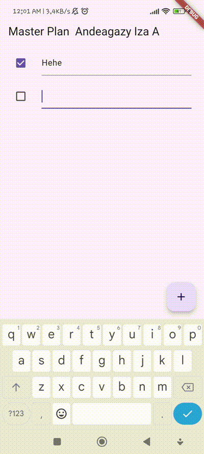


## Tugas Praktikum 1

### 2. Jelaskan maksud dari langkah 4 pada praktikum tersebut! Mengapa dilakukan demikian?
Fungsi dari kode di atas adalah menggabungkan ekspor dari beberapa file model (plan.dart dan task.dart) ke dalam satu titik akses. Dengan demikian, ketika file atau komponen lain dalam aplikasi membutuhkan akses ke model Plan dan Task, kamu cukup melakukan impor terhadap data_layer.dart saja, bukan mengimpor setiap model satu per satu.
### 3. Mengapa perlu variabel plan di langkah 6 pada praktikum tersebut? Mengapa dibuat konstanta ?
Variabel plan di langkah 6 berfungsi untuk menyimpan daftar tugas yang akan ditampilkan di PlanScreen. Kita memerlukan variabel ini agar bisa mengelola data tugas, seperti menambah atau menghapus tugas di layar aplikasi.

Dibuat sebagai konstanta (const) karena objek Plan awalnya tidak memiliki data yang bisa diubah. Ini membuat inisialisasi lebih efisien. Namun, meski Plan itu sendiri bersifat tetap, isi daftar tugas di dalamnya tetap bisa diubah nantinya saat aplikasi berjalan.
### 4. Lakukan capture hasil dari Langkah 9 berupa GIF, kemudian jelaskan apa yang telah Anda buat!

**Hasil**


### 5. Apa kegunaan method pada Langkah 11 dan 13 dalam lifecyle state ?

Pada langkah 11, initState() digunakan untuk menginisialisasi scrollController dan menambahkan listener agar keyboard otomatis tertutup saat pengguna scroll layar. Ini memastikan tampilan tetap rapi ketika scroll.

Sedangkan pada langkah 13, dispose() digunakan untuk membersihkan scrollController saat widget dihapus. Ini penting agar tidak terjadi kebocoran memori, karena listener dan controller yang tidak dibersihkan bisa tetap aktif di latar belakang.

## Praktikum 2

### Langkah 1: Buat file plan_provider.dart
Buat folder baru provider di dalam folder lib, lalu buat file baru dengan nama plan_provider.dart berisi kode seperti berikut.

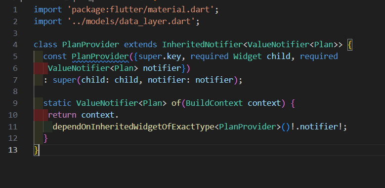

### Langkah 2: Edit main.dart
Gantilah pada bagian atribut home dengan PlanProvider seperti berikut. Jangan lupa sesuaikan bagian impor jika dibutuhkan.

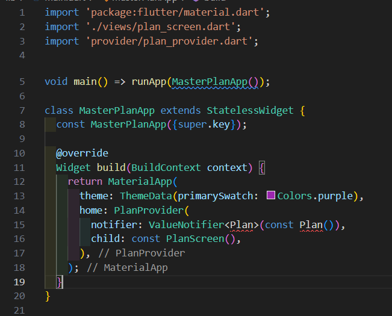

### Langkah 3: Tambah method pada model plan.dart
Tambahkan dua method di dalam model class Plan seperti kode berikut.

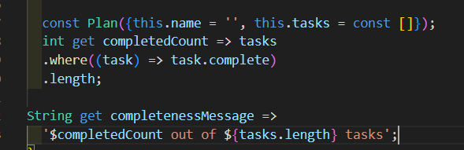

### Langkah 4: Pindah ke PlanScreen
Edit PlanScreen agar menggunakan data dari PlanProvider. Hapus deklarasi variabel plan (ini akan membuat error). Kita akan perbaiki pada langkah 5 berikut ini.

### Langkah 5: Edit method _buildAddTaskButton
Tambahkan BuildContext sebagai parameter dan gunakan PlanProvider sebagai sumber datanya. Edit bagian kode seperti berikut.

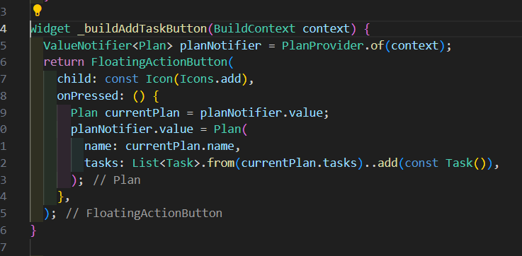

### Langkah 6: Edit method _buildTaskTile
Tambahkan parameter BuildContext, gunakan PlanProvider sebagai sumber data. Ganti TextField menjadi TextFormField untuk membuat inisial data provider menjadi lebih mudah.

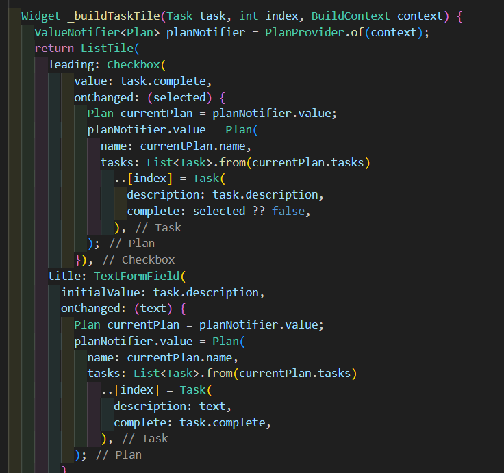

### Langkah 7: Edit _buildList
Sesuaikan parameter pada bagian _buildTaskTile seperti kode berikut.

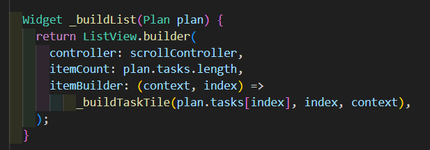

### Langkah 8: Tetap di class PlanScreen
Edit method build sehingga bisa tampil progress pada bagian bawah (footer). Caranya, bungkus (wrap) _buildList dengan widget Expanded dan masukkan ke dalam widget Column seperti kode pada Langkah 9.


### Langkah 9: Tambah widget SafeArea
Terakhir, tambahkan widget SafeArea dengan berisi completenessMessage pada akhir widget Column. Perhatikan kode berikut ini.

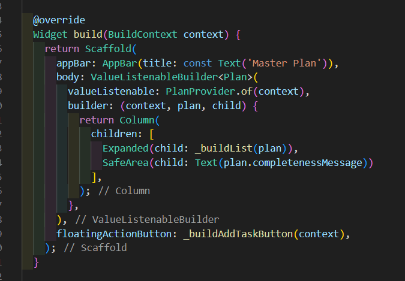


## Tugas Praktikum 2

### 2. Jelaskan mana yang dimaksud InheritedWidget pada langkah 1 tersebut! Mengapa yang digunakan InheritedNotifier?
- InheritedWidget adalah jenis Widget khusus di Flutter yang memungkinkan data untuk "diwariskan" (inherited) ke semua Widget yang menjadi turunannya. InheritedWidget biasanya digunakan ketika data perlu dibagikan atau diakses oleh banyak Widget di pohon widget tanpa perlu secara eksplisit meneruskan data tersebut melalui setiap Widget secara manual. Hal ini berguna untuk state management, seperti pembagian status antar halaman atau widget yang terpisah.

- InheritedNotifier adalah subclass dari InheritedWidget yang dirancang untuk mengoptimalkan pembaruan UI dengan menggunakan notifikasi. InheritedNotifier memungkinkan untuk membagikan data yang berubah-ubah (dinamis) sambil tetap mengurangi pembaruan widget yang tidak perlu, dengan memanfaatkan notifier.

### 3. Jelaskan maksud dari method di langkah 3 pada praktikum tersebut! Mengapa dilakukan demikian?
- completedCount:

Menghitung jumlah tugas yang selesai di dalam daftar tasks.
Ini mempermudah akses ke jumlah tugas yang sudah selesai.
- completenessMessage:

Membuat pesan seperti “3 out of 5 tasks” untuk menunjukkan progres tugas.
Ini memudahkan untuk menampilkan informasi penyelesaian tugas tanpa menghitung ulang setiap kali.

### 4.Lakukan capture hasil dari Langkah 9 berupa GIF, kemudian jelaskan apa yang telah Anda buat!

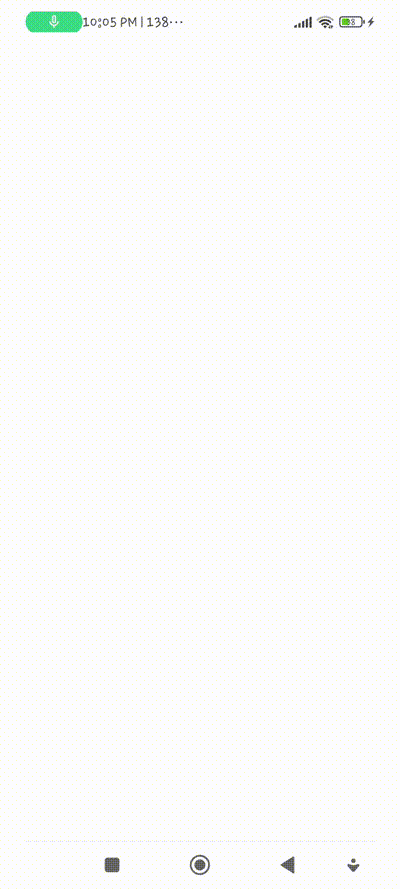


## Praktikum 3

### Langkah 1: Edit PlanProvider
Perhatikan kode berikut, edit class PlanProvider sehingga dapat menangani List Plan.

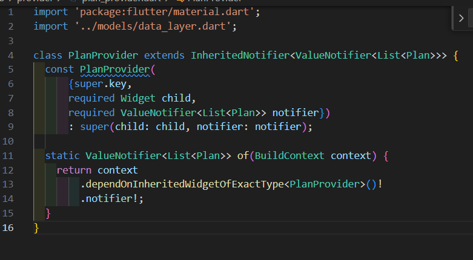

### Langkah 2: Edit main.dart
Langkah sebelumnya dapat menyebabkan error pada main.dart dan plan_screen.dart. Pada method build, gantilah menjadi kode seperti ini.

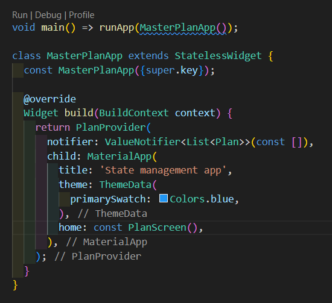

### Langkah 3: Edit plan_screen.dart
Tambahkan variabel plan dan atribut pada constructor-nya seperti berikut.

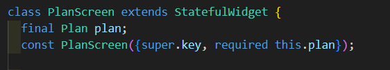

### Langkah 4: Error
Itu akan terjadi error setiap kali memanggil PlanProvider.of(context). Itu terjadi karena screen saat ini hanya menerima tugas-tugas untuk satu kelompok Plan, tapi sekarang PlanProvider menjadi list dari objek plan tersebut.

### Langkah 5: Tambah getter Plan
Tambahkan getter pada _PlanScreenState seperti kode berikut.

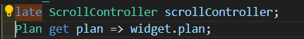

### Langkah 6: Method initState()
Pada bagian ini kode tetap seperti berikut.

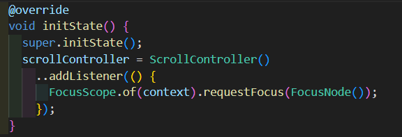

### Langkah 7: Widget build
Pastikan Anda telah merubah ke List dan mengubah nilai pada currentPlan seperti kode berikut ini.


### Langkah 8: Edit _buildTaskTile
Pastikan ubah ke List dan variabel planNotifier seperti kode berikut ini.

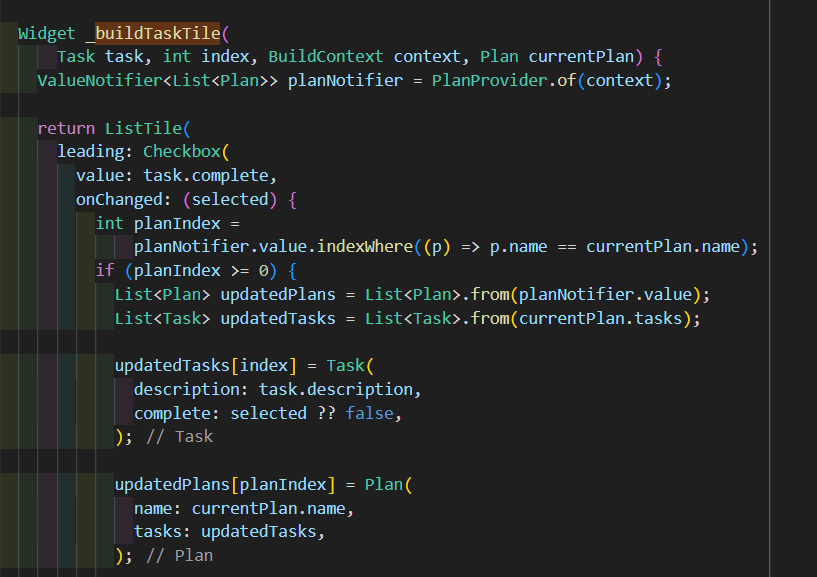

### Langkah 9: Buat screen baru
Pada folder view, buatlah file baru dengan nama plan_creator_screen.dart dan deklarasikan dengan StatefulWidget bernama PlanCreatorScreen. Gantilah di main.dart pada atribut home menjadi seperti berikut.

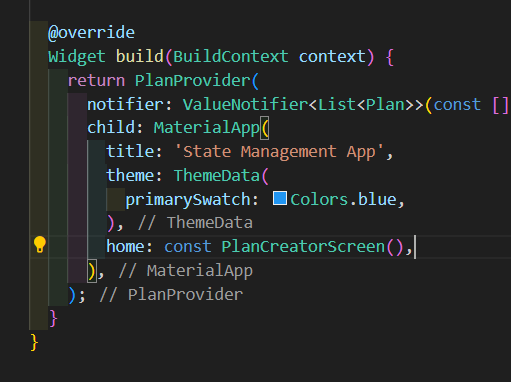

### Langkah 10: Pindah ke class _PlanCreatorScreenState
Kita perlu tambahkan variabel TextEditingController sehingga bisa membuat TextField sederhana untuk menambah Plan baru. Jangan lupa tambahkan dispose ketika widget unmounted seperti kode berikut.

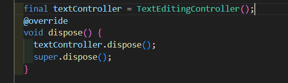

### Langkah 11: Pindah ke method build
Letakkan method Widget build berikut di atas void dispose. Gantilah ‘Namaku' dengan nama panggilan Anda.

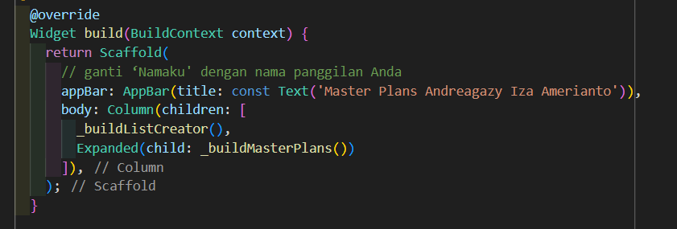


### Langkah 12: Buat widget _buildListCreator
Buatlah widget berikut setelah widget build.

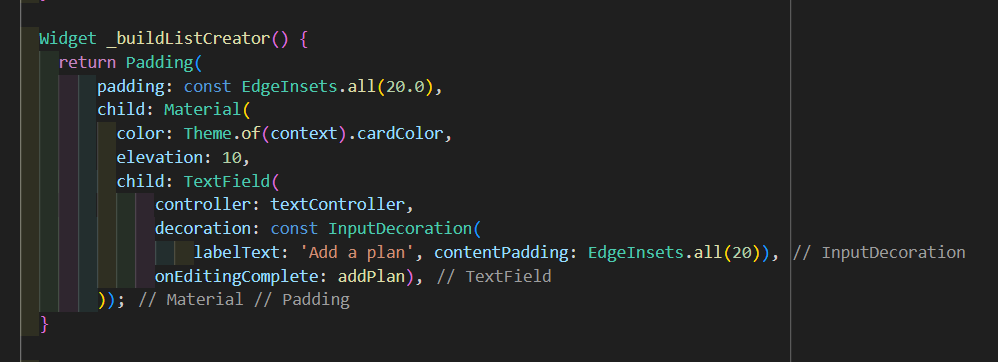

### Langkah 13: Buat void addPlan()
Tambahkan method berikut untuk menerima inputan dari user berupa text plan.

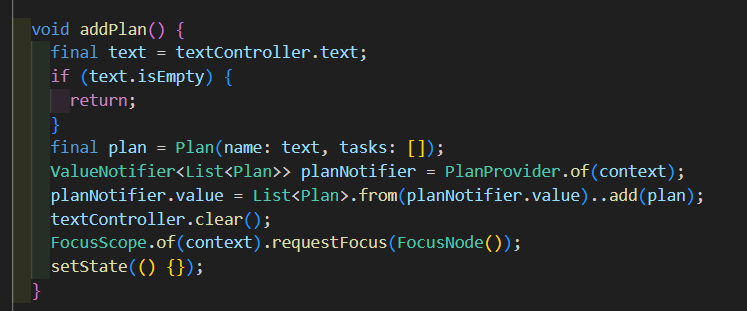

### Langkah 14: Buat widget _buildMasterPlans()
Tambahkan widget seperti kode berikut.


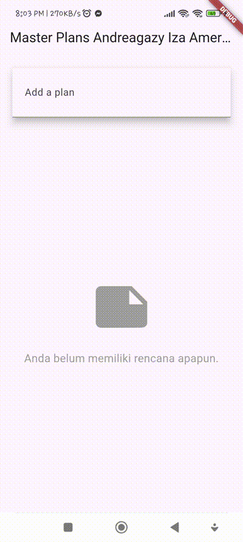

## Tugas Praktikum 3

### 2. Berdasarkan Praktikum 3 yang telah Anda lakukan, jelaskan maksud dari gambar diagram berikut ini!


- Bagian Kiri:

Bagian ini merupakan layar awal aplikasi dengan MaterialApp sebagai widget utama.
Terdapat widget PlanProvider, yang mungkin digunakan untuk mengelola state atau memberikan data ke widget anak.
Layar utama di sini adalah PlanCreatorScreen, yang memiliki susunan Column berisi TextField dan widget Expanded yang memuat ListView.
Struktur ini menunjukkan bahwa layar ini kemungkinan digunakan untuk membuat rencana, di mana pengguna bisa memasukkan data melalui TextField dan melihat daftar item di ListView.


- Navigator Push (Perpindahan):

Fungsi Navigator.push digunakan untuk berpindah ke layar baru ketika terjadi suatu peristiwa (misalnya, menekan tombol).

- Bagian Kanan:

Layar tujuan ini memiliki struktur dengan MaterialApp di bagian paling atas, diikuti oleh PlanScreen.
PlanScreen memiliki Scaffold, yang memberikan struktur dasar seperti app bar, drawer, dan lainnya.
Di dalam Scaffold, ada susunan Column yang berisi Expanded dengan ListView (untuk menampilkan daftar item) dan SafeArea dengan Text.
Susunan ini menunjukkan bahwa PlanScreen digunakan untuk menampilkan rincian dari rencana yang telah dibuat, menggunakan SafeArea agar elemen UI berada di area aman pada layar perangkat.


### 3. Lakukan capture hasil dari Langkah 14 berupa GIF, kemudian jelaskan apa yang telah Anda buat!


