# 11 | Pemrograman Asynchronous

## Praktikum 1: Mengunduh Data dari Web Service (API)

### Langkah 1: Buat Project Baru
Buatlah sebuah project flutter baru dengan nama books di folder src week-11 repository GitHub Anda.

Kemudian Tambahkan dependensi  dengan mengetik perintah berikut di terminal.

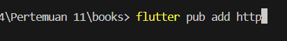

### Langkah 2: Cek file pubspec.yaml
Jika berhasil install plugin, pastikan plugin  telah ada di file pubspec ini seperti berikut.

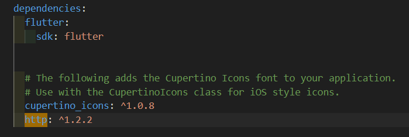


### Langkah 3: Buka file main.dart
Ketiklah kode seperti berikut ini.

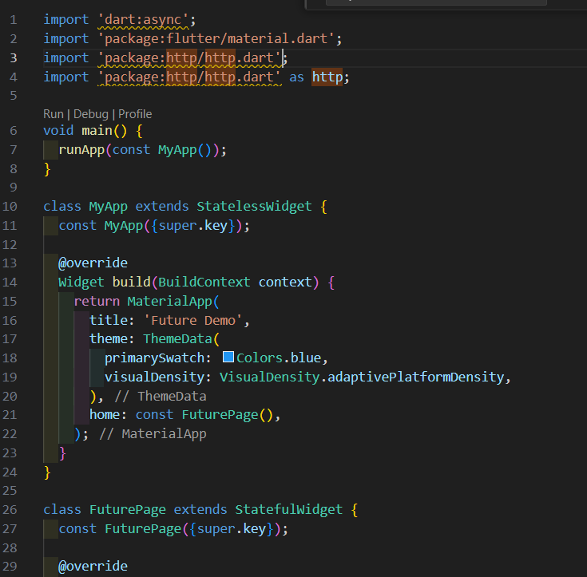

```md
#### Soal 1
Tambahkan nama panggilan Anda pada title app sebagai identitas hasil pekerjaan Anda.

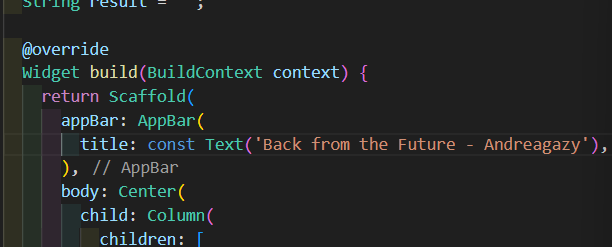
```

### Langkah 4: Tambah method getData()
Tambahkan method ini ke dalam class _FuturePageState yang berguna untuk mengambil data dari API Google Books.

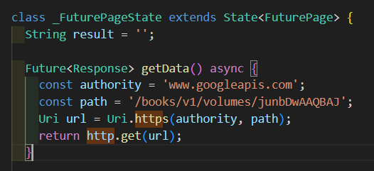

```md
#### Soal 2
- Carilah judul buku favorit Anda di Google Books, lalu ganti ID buku pada variabel path di kode tersebut. Caranya ambil di URL browser Anda seperti gambar berikut ini.


- Kemudian cobalah akses di browser URI tersebut dengan lengkap seperti ini. Jika menampilkan data JSON, maka Anda telah berhasil. Lakukan capture milik Anda dan tulis di README pada laporan praktikum. Lalu lakukan commit dengan pesan "W11: Soal 2".
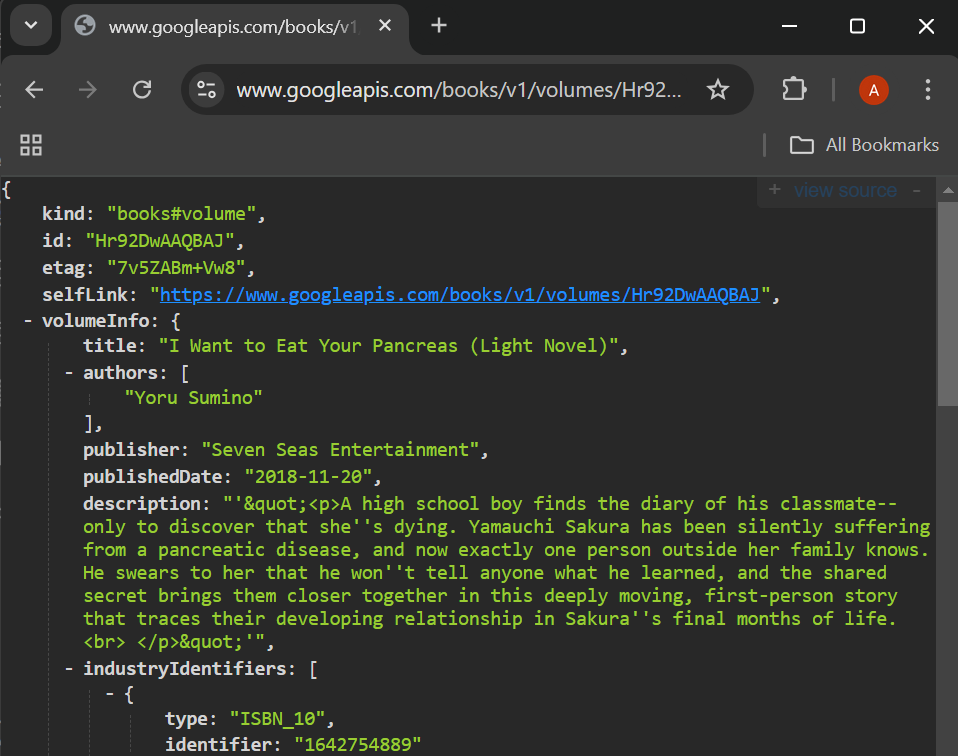
```

### Langkah 5: Tambah kode di ElevatedButton
Tambahkan kode pada onPressed di ElevatedButton seperti berikut.

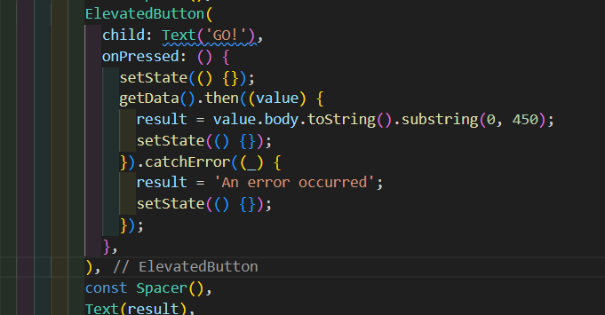

Lakukan run aplikasi Flutter Anda. Anda akan melihat tampilan akhir seperti gambar berikut. Jika masih terdapat error, silakan diperbaiki hingga bisa running.

### Hasil
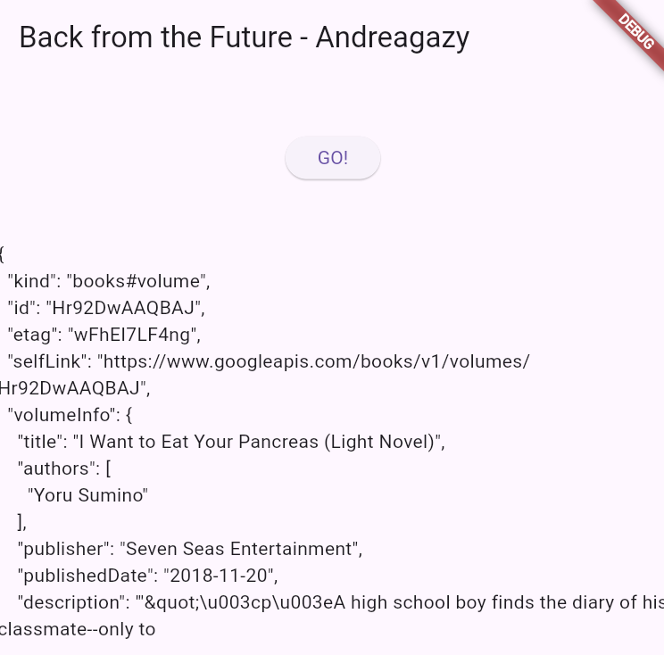

```md
#### Soal 3
- Jelaskan maksud kode langkah 5 tersebut terkait substring dan catchError!
`substring(0, 450)` berfungsi untuk mengambil bagian awal dari body respons HTTP dengan panjang maksimal 450 karakter. `catchError` berfungsi untuk menangani error yang mungkin terjadi saat memanggil fungsi getData(). 
- Capture hasil praktikum Anda berupa GIF dan lampirkan di README. Lalu lakukan commit dengan pesan "W11: Soal 3".


```

## Praktikum 2: Menggunakan await/async untuk menghindari callbacks

### Langkah 1: Buka file main.dart
Tambahkan tiga method berisi kode seperti berikut di dalam class _FuturePageState.

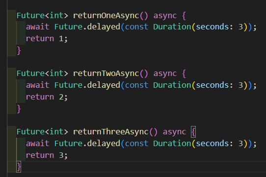

### Langkah 2: Tambah method count()
Lalu tambahkan lagi method ini di bawah ketiga method sebelumnya.

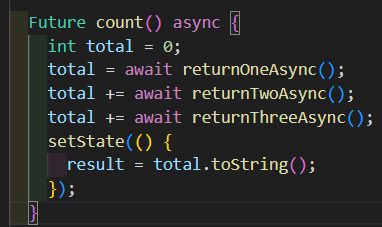

### Langkah 3: Panggil count()
Lakukan comment kode sebelumnya, ubah isi kode onPressed() menjadi seperti berikut.

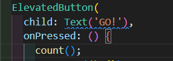

### Langkah 4: Run
Akhirnya, run atau tekan F5 jika aplikasi belum running. Maka Anda akan melihat seperti gambar berikut, hasil angka 6 akan tampil setelah delay 9 detik.


```md
#### Soal 4
- Jelaskan maksud kode langkah 1 dan 2 tersebut!
Kode pada Langkah 1 terdiri dari tiga fungsi asinkron (returnOneAsync, returnTwoAsync, dan returnThreeAsync) yang masing-masing menunggu selama 3 detik sebelum mengembalikan angka 1, 2, dan 3. Pada Langkah 2, saat tombol GO! ditekan, fungsi count() dipanggil untuk menjalankan proses tersebut, kemungkinan menjumlahkan hasil dari ketiga fungsi asinkron tersebut.
- Capture hasil praktikum Anda berupa GIF dan lampirkan di README. Lalu lakukan commit dengan pesan "W11: Soal 4".
``` 


## Praktikum 3: Menggunakan Completer di Future

### Langkah 1: Buka main.dart
Pastikan telah impor package async berikut.

```dart
import 'package:async/async.dart';
```

### Langkah 2: Tambahkan variabel dan method
Tambahkan variabel late dan method di class _FuturePageState seperti ini.

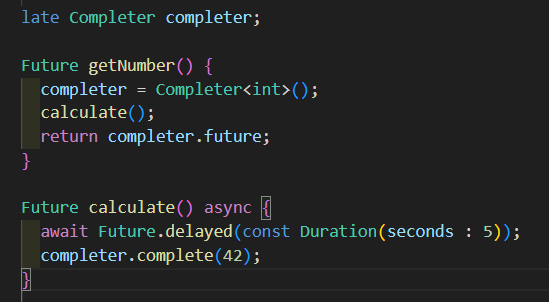

### Langkah 3: Ganti isi kode onPressed()
Tambahkan kode berikut pada fungsi onPressed(). Kode sebelumnya bisa Anda comment.

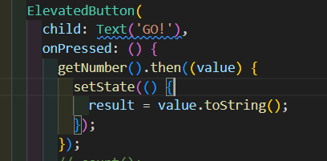

### Langkah 4:
Terakhir, run atau tekan F5 untuk melihat hasilnya jika memang belum running. Bisa juga lakukan hot restart jika aplikasi sudah running. Maka hasilnya akan seperti gambar berikut ini. Setelah 5 detik, maka angka 42 akan tampil.

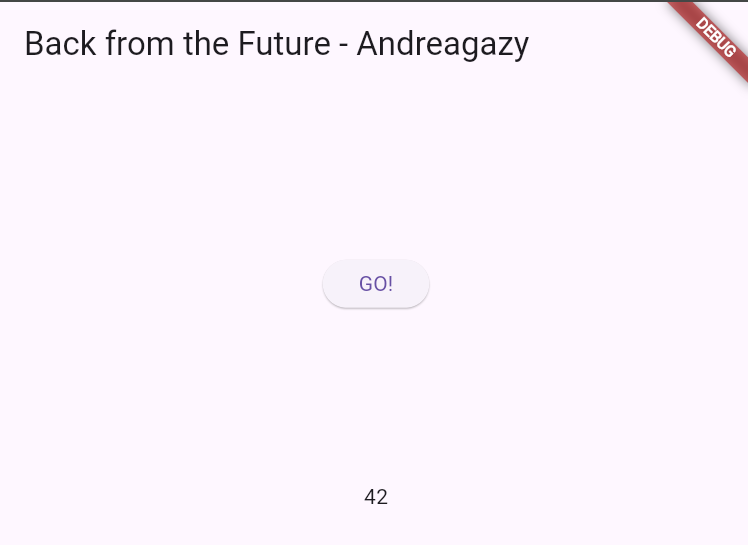

```md
#### Soal 5
- Jelaskan maksud kode langkah 2 tersebut!
completer = Completer<int>();: Membuat objek Completer yang dapat menyelesaikan sebuah Future dengan nilai bertipe int.
getNumber(): Mengembalikan Future yang akan diselesaikan oleh Completer setelah proses perhitungan selesai.
calculate(): Fungsi asinkron yang menunggu selama 5 detik menggunakan Future.delayed sebelum memanggil completer.complete(42);, yang menyelesaikan Future dengan nilai 42.
- Capture hasil praktikum Anda berupa GIF dan lampirkan di README. Lalu lakukan commit dengan pesan "W11: Soal 5".
```

### Langkah 5: Ganti method calculate()
Gantilah isi code method calculate() seperti kode berikut, atau Anda dapat membuat calculate2()

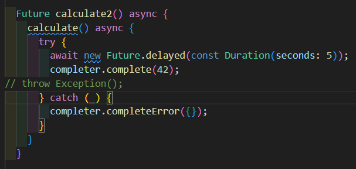

### Langkah 6: Pindah ke onPressed()
Ganti menjadi kode seperti berikut.

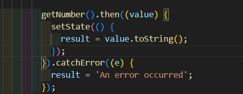


```md
#### Soal 6
- Jelaskan maksud perbedaan kode langkah 2 dengan langkah 5-6 tersebut!
Kode sekarang memiliki try-catch di dalam fungsi calculate() untuk menangkap error. Jika terjadi error, completer.completeError({}) dipanggil, menandakan bahwa Future berakhir dengan error.
- Capture hasil praktikum Anda berupa GIF dan lampirkan di README. Lalu lakukan commit dengan pesan "W11: Soal 6".
```

## Praktikum 4: Memanggil Future secara paralel

### Langkah 1: Buka file main.dart
Tambahkan method ini ke dalam class _FuturePageState

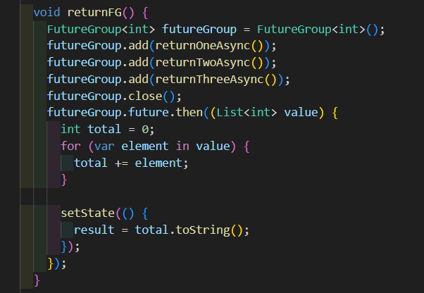

### Langkah 2: Edit onPressed()
Anda bisa hapus atau comment kode sebelumnya, kemudian panggil method dari langkah 1 tersebut.

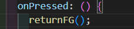

### Langkah 3: Run
Anda akan melihat hasilnya dalam 3 detik berupa angka 6 lebih cepat dibandingkan praktikum sebelumnya menunggu sampai 9 detik.

```md
#### Soal 7
- Capture hasil praktikum Anda berupa GIF dan lampirkan di README. Lalu lakukan commit dengan pesan "W11: Soal 7".
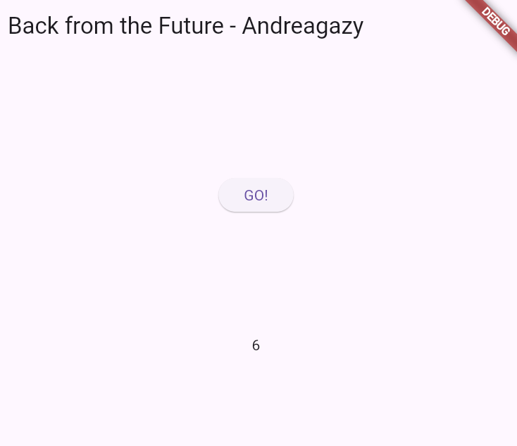

```

### Langkah 4: Ganti variabel futureGroup
Anda dapat menggunakan FutureGroup dengan Future.wait seperti kode berikut.

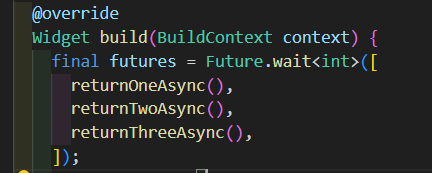

```md

#### Soal 8
- Jelaskan maksud perbedaan kode langkah 1 dan 4!
Langkah 1 : FutureGroup<int> adalah koleksi Future yang memungkinkan untuk menambahkan tugas secara dinamis dan menunggu hingga semuanya selesai.
Fungsi returnFG() menambahkan tiga Future (returnOneAsync, returnTwoAsync, returnThreeAsync) ke dalam grup, menutup grup dengan close(), lalu menunggu hingga semuanya selesai.
Setelah selesai, nilai-nilai dari setiap Future dikumpulkan, dijumlahkan menjadi 6, dan hasilnya diperbarui ke UI menggunakan setState(). <br>

Langkah 2 : Future.wait<int>([]) langsung menunggu kumpulan Future yang diberikan sebagai daftar sejak awal.
Fungsi ini menjalankan tiga Future (returnOneAsync, returnTwoAsync, returnThreeAsync) secara paralel dan menunggu hingga semuanya selesai, tanpa memerlukan langkah tambahan seperti close().
```

## Praktikum 5: Menangani Respon Error pada Async Code

### Langkah 1: Buka file main.dart
Tambahkan method ini ke dalam class _FuturePageState

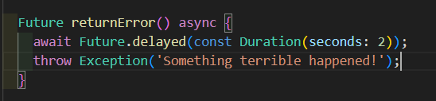

### Langkah 2: ElevatedButton
Ganti dengan kode berikut
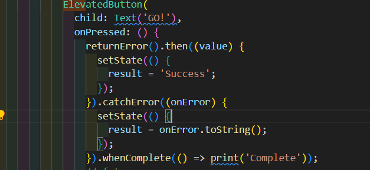

### Langkah 3: Run
Lakukan run dan klik tombol GO! maka akan menghasilkan seperti gambar berikut.
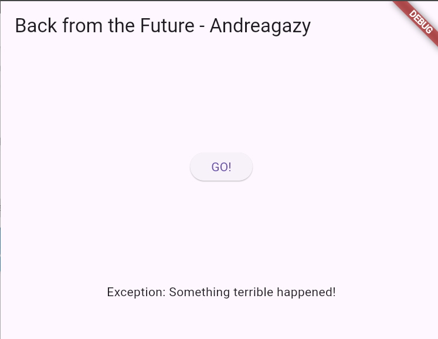
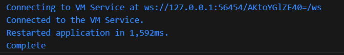

```md
#### Soal 9
Capture hasil praktikum Anda berupa GIF dan lampirkan di README. Lalu lakukan commit dengan pesan "W11: Soal 9".
```

### Langkah 4: Tambah method handleError()
Tambahkan kode ini di dalam class _FutureStatePage
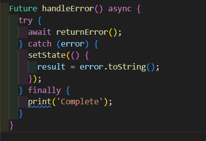

```md
#### Soal 10
Panggil method handleError() tersebut di ElevatedButton, lalu run. Apa hasilnya? Jelaskan perbedaan kode langkah 1 dan 4! 
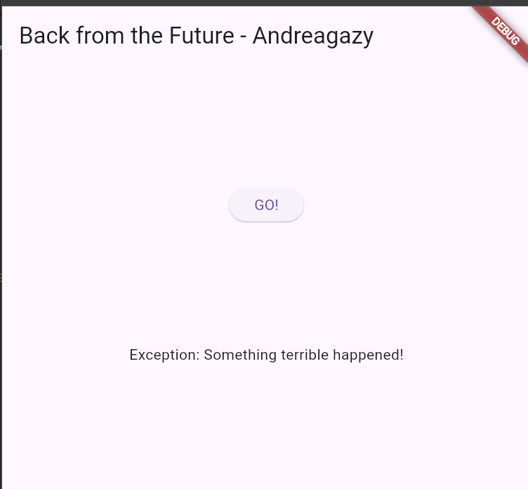
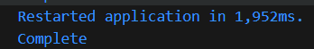

<br><br>
 returnError() bertugas menunda eksekusi selama 2 detik menggunakan Future.delayed lalu melemparkan sebuah error dengan pesan tertentu. Fungsi ini hanya memicu error tanpa penanganan lebih lanjut. Sementara itu, handleError() memanggil returnError dan menangani error tersebut menggunakan try-catch. Jika error terjadi, fungsi ini akan menangkapnya, memperbarui hasil ke UI dengan setState, dan menampilkan pesan error. Setelah itu, blok finally memastikan bahwa pesan 'Complete' selalu dicetak, terlepas dari apakah operasi berhasil atau gagal.
```

## Praktikum 6: Menggunakan Future dengan StatefulWidget

### Langkah 1: install plugin geolocator
Tambahkan plugin geolocator dengan mengetik perintah berikut di terminal.
```dart
flutter pub add geolocator
```

### Langkah 2: Tambah permission GPS
Jika Anda menargetkan untuk platform Android, maka tambahkan baris kode berikut di file android/app/src/main/androidmanifest.xml
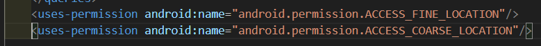

### Langkah 3: Buat file geolocation.dart
Tambahkan file baru ini di folder lib project Anda.
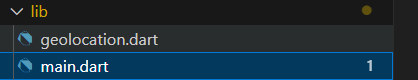

### Langkah 4: Buat StatefulWidget
Buat class LocationScreen di dalam file geolocation.dart
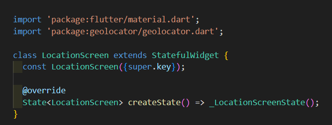

### Langkah 5: Isi kode geolocation.dart
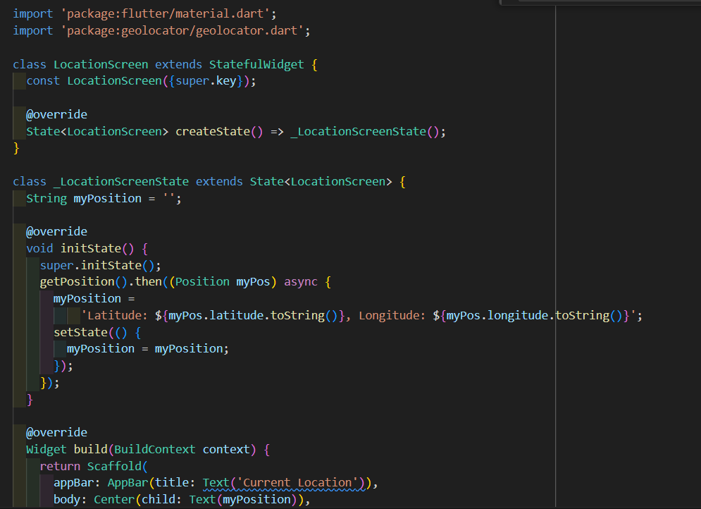

```md
#### Soal 11
Tambahkan nama panggilan Anda pada tiap properti title sebagai identitas pekerjaan Anda.
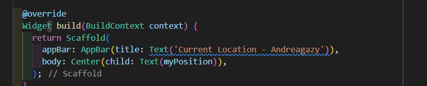
```

### Langkah 6: Edit main.dart
Panggil screen baru tersebut di file main Anda seperti berikut.

```dart
home: LocationScreen(),
```

### Langkah 7: Run
Run project Anda di device atau emulator (bukan browser), maka akan tampil seperti berikut ini.

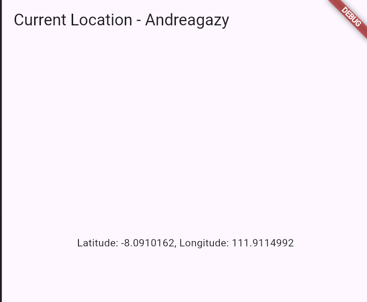

### Langkah 8: Tambahkan animasi loading
Tambahkan widget loading seperti kode berikut. Lalu hot restart, perhatikan perubahannya.
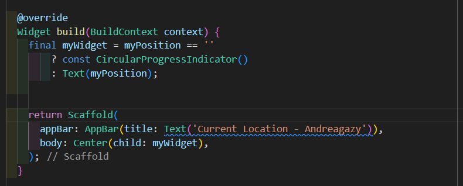

```md
#### Soal 12
- Jika Anda tidak melihat animasi loading tampil, kemungkinan itu berjalan sangat cepat. Tambahkan delay pada method getPosition() dengan kode await Future.delayed(const Duration(seconds: 3));

- Apakah Anda mendapatkan koordinat GPS ketika run di browser? Mengapa demikian?
Bisa mendapatkan koordinat GPS ketika run di browser, tetapi perlu allow access seperti gambar tersebut
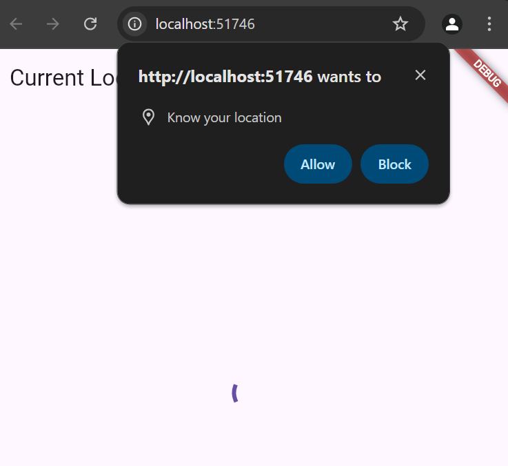
- Capture hasil praktikum Anda berupa GIF dan lampirkan di README. Lalu lakukan commit dengan pesan "W11: Soal 12".
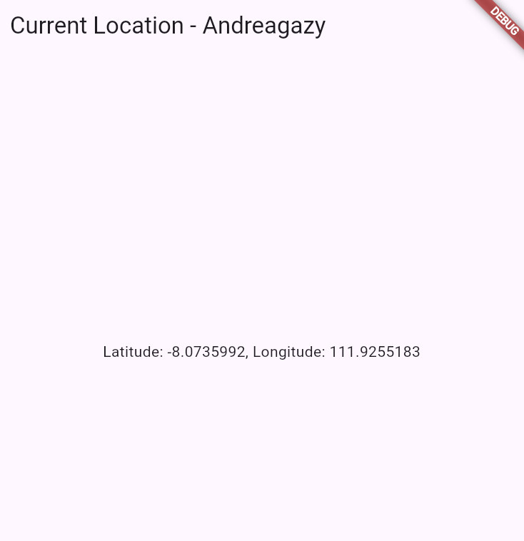
```

## Praktikum 7: Manajemen Future dengan FutureBuilder

### Langkah 1: Modifikasi method getPosition()
Buka file geolocation.dart kemudian ganti isi method dengan kode ini.

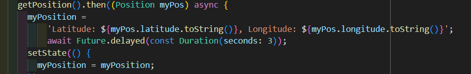

### Langkah 2: Tambah variabel
Tambah variabel ini di class _LocationScreenState
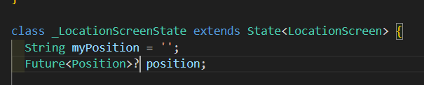

### Langkah 3: Tambah initState()
Tambah method ini dan set variabel position
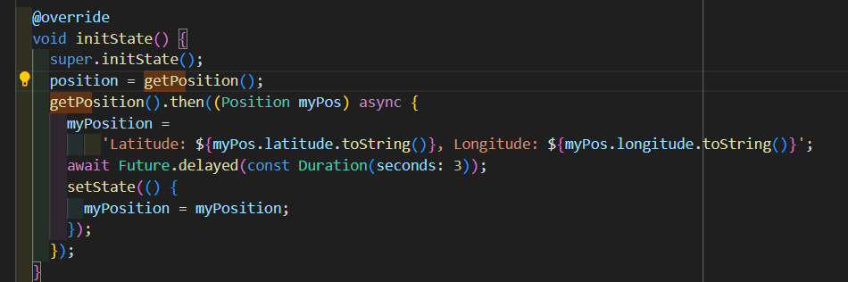

### Langkah 4: Edit method build()
Ketik kode berikut dan sesuaikan. Kode lama bisa Anda comment atau hapus.
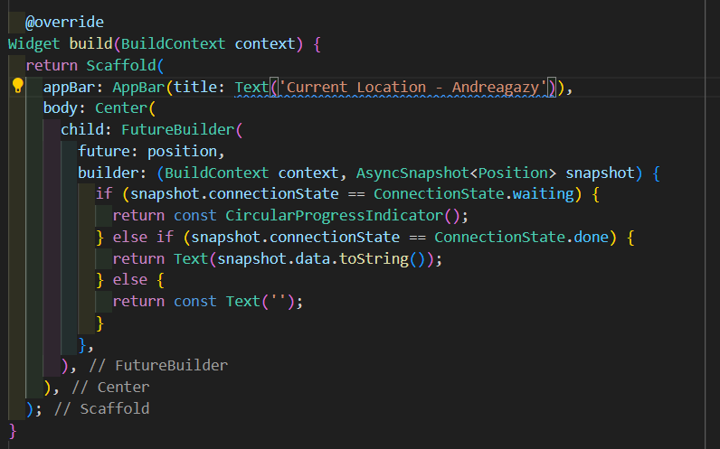

```md
#### Soal 13
- Apakah ada perbedaan UI dengan praktikum sebelumnya? Mengapa demikian?
Perbedaan utama pada tampilan kode ini adalah adanya indikator loading berupa CircularProgressIndicator yang muncul saat aplikasi memproses data lokasi, sehingga pengguna tahu proses sedang berlangsung. Lokasi ditampilkan dengan lebih jelas menggunakan label seperti "Latitude" dan "Longitude." Selain itu, ada jeda sebelum data muncul, memberikan kesan tampilan yang lebih rapi dan terstruktur.
- Capture hasil praktikum Anda berupa GIF dan lampirkan di README. Lalu lakukan commit dengan pesan "W11: Soal 13".
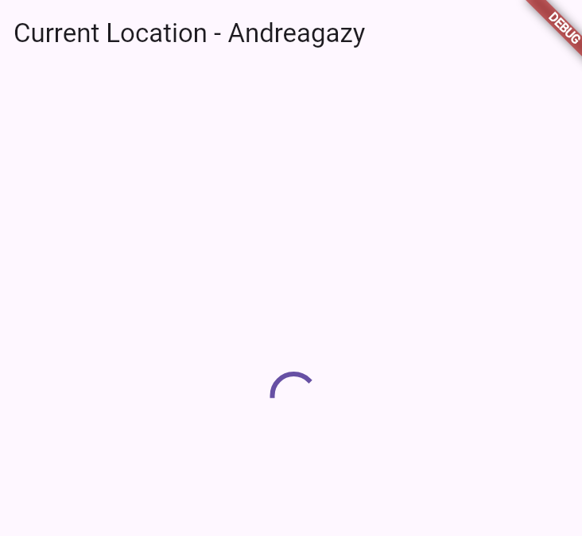
- Seperti yang Anda lihat, menggunakan FutureBuilder lebih efisien, clean, dan reactive dengan Future bersama UI.
```

### Langkah 5: Tambah handling error
Tambahkan kode berikut untuk menangani ketika terjadi error. Kemudian hot restart.
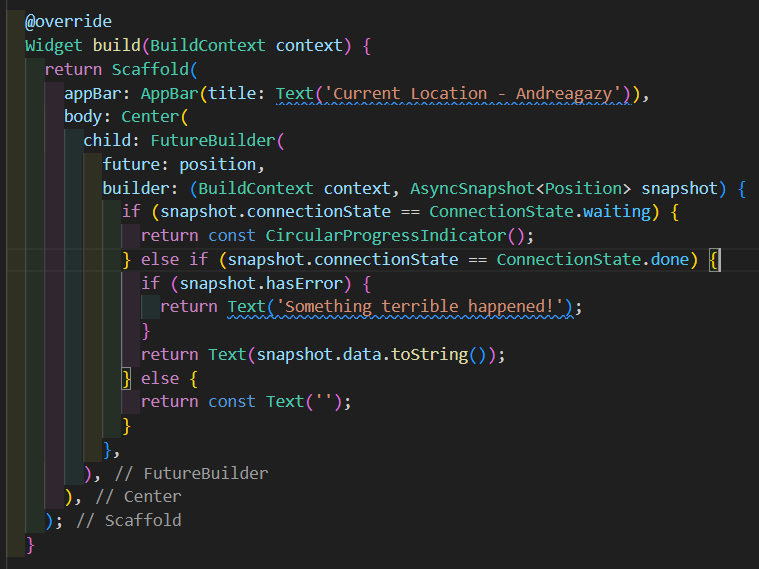

```md
#### Soal 14
- Apakah ada perbedaan UI dengan langkah sebelumnya? Mengapa demikian?
Iya terdapat perbedaan ketika tida bisa mendapat akses lokasi sehingga muncul kata "Something Terible Happend"
- Capture hasil praktikum Anda berupa GIF dan lampirkan di README. Lalu lakukan commit dengan pesan "W11: Soal 14".
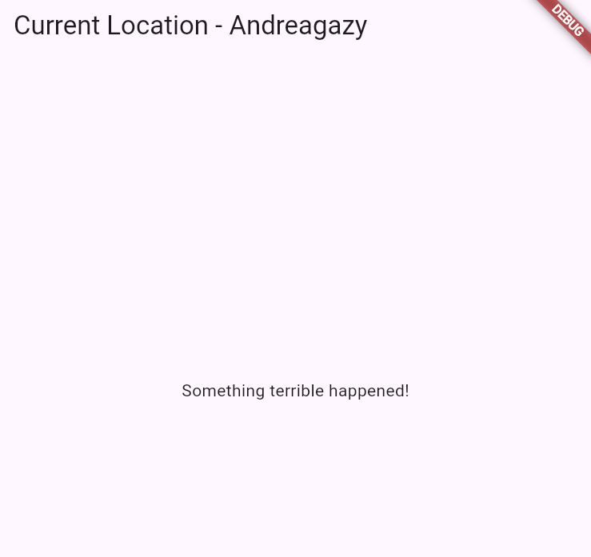

```
## 
