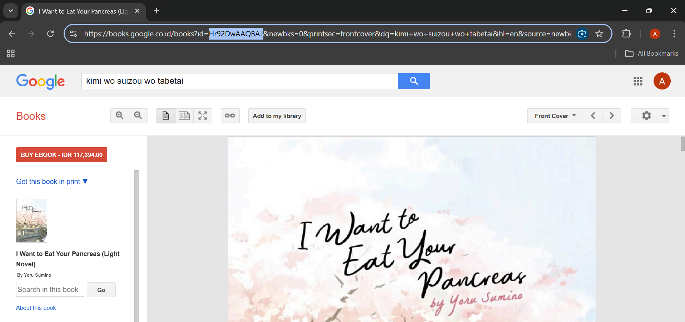

# 11 | Pemrograman Asynchronous

## Praktikum 1 

### Langkah 1: Buat Project Baru
Buatlah sebuah project flutter baru dengan nama books di folder src week-11 repository GitHub Anda.

Kemudian Tambahkan dependensi  dengan mengetik perintah berikut di terminal.


### Langkah 2: Cek file pubspec.yaml
Jika berhasil install plugin, pastikan plugin  telah ada di file pubspec ini seperti berikut.


### Langkah 3: Buka file main.dart
Ketiklah kode seperti berikut ini.


```md
#### Soal 1
Tambahkan nama panggilan Anda pada title app sebagai identitas hasil pekerjaan Anda.


```

### Langkah 4: Tambah method getData()
Tambahkan method ini ke dalam class _FuturePageState yang berguna untuk mengambil data dari API Google Books.


```md
- Carilah judul buku favorit Anda di Google Books, lalu ganti ID buku pada variabel path di kode tersebut. Caranya ambil di URL browser Anda seperti gambar berikut ini.



- Kemudian cobalah akses di browser URI tersebut dengan lengkap seperti ini. Jika menampilkan data JSON, maka Anda telah berhasil. Lakukan capture milik Anda dan tulis di README pada laporan praktikum. Lalu lakukan commit dengan pesan "W11: Soal 2".

```


