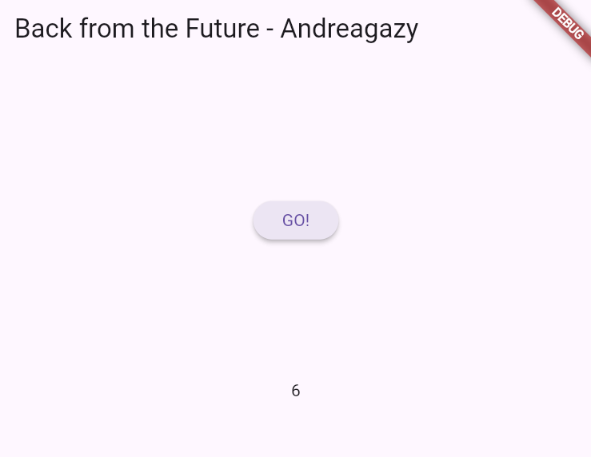

# 11 | Pemrograman Asynchronous

## Praktikum 1: Mengunduh Data dari Web Service (API)

### Langkah 1: Buat Project Baru
Buatlah sebuah project flutter baru dengan nama books di folder src week-11 repository GitHub Anda.

Kemudian Tambahkan dependensi  dengan mengetik perintah berikut di terminal.


### Langkah 2: Cek file pubspec.yaml
Jika berhasil install plugin, pastikan plugin  telah ada di file pubspec ini seperti berikut.


### Langkah 3: Buka file main.dart
Ketiklah kode seperti berikut ini.


```md
#### Soal 1
Tambahkan nama panggilan Anda pada title app sebagai identitas hasil pekerjaan Anda.


```

### Langkah 4: Tambah method getData()
Tambahkan method ini ke dalam class _FuturePageState yang berguna untuk mengambil data dari API Google Books.


```md
#### Soal 2
- Carilah judul buku favorit Anda di Google Books, lalu ganti ID buku pada variabel path di kode tersebut. Caranya ambil di URL browser Anda seperti gambar berikut ini.


- Kemudian cobalah akses di browser URI tersebut dengan lengkap seperti ini. Jika menampilkan data JSON, maka Anda telah berhasil. Lakukan capture milik Anda dan tulis di README pada laporan praktikum. Lalu lakukan commit dengan pesan "W11: Soal 2".

```

### Langkah 5: Tambah kode di ElevatedButton
Tambahkan kode pada onPressed di ElevatedButton seperti berikut.


Lakukan run aplikasi Flutter Anda. Anda akan melihat tampilan akhir seperti gambar berikut. Jika masih terdapat error, silakan diperbaiki hingga bisa running.

### Hasil


```md
#### Soal 3
- Jelaskan maksud kode langkah 5 tersebut terkait substring dan catchError!
`substring(0, 450)` berfungsi untuk mengambil bagian awal dari body respons HTTP dengan panjang maksimal 450 karakter. `catchError` berfungsi untuk menangani error yang mungkin terjadi saat memanggil fungsi getData(). 
- Capture hasil praktikum Anda berupa GIF dan lampirkan di README. Lalu lakukan commit dengan pesan "W11: Soal 3".


```

## Praktikum 2: Menggunakan await/async untuk menghindari callbacks

### Langkah 1: Buka file main.dart
Tambahkan tiga method berisi kode seperti berikut di dalam class _FuturePageState.


### Langkah 2: Tambah method count()
Lalu tambahkan lagi method ini di bawah ketiga method sebelumnya.


### Langkah 3: Panggil count()
Lakukan comment kode sebelumnya, ubah isi kode onPressed() menjadi seperti berikut.


### Langkah 4: Run
Akhirnya, run atau tekan F5 jika aplikasi belum running. Maka Anda akan melihat seperti gambar berikut, hasil angka 6 akan tampil setelah delay 9 detik.



```md
#### Soal 4
- Jelaskan maksud kode langkah 1 dan 2 tersebut!
Kode pada Langkah 1 terdiri dari tiga fungsi asinkron (returnOneAsync, returnTwoAsync, dan returnThreeAsync) yang masing-masing menunggu selama 3 detik sebelum mengembalikan angka 1, 2, dan 3. Pada Langkah 2, saat tombol GO! ditekan, fungsi count() dipanggil untuk menjalankan proses tersebut, kemungkinan menjumlahkan hasil dari ketiga fungsi asinkron tersebut.
- Capture hasil praktikum Anda berupa GIF dan lampirkan di README. Lalu lakukan commit dengan pesan "W11: Soal 4".
``` 


## Praktikum 3: Menggunakan Completer di Future

### Langkah 1: Buka main.dart
Pastikan telah impor package async berikut.

```dart
import 'package:async/async.dart';
```

### Langkah 2: Tambahkan variabel dan method
Tambahkan variabel late dan method di class _FuturePageState seperti ini.


### Langkah 3: Ganti isi kode onPressed()
Tambahkan kode berikut pada fungsi onPressed(). Kode sebelumnya bisa Anda comment.


### Langkah 4:
Terakhir, run atau tekan F5 untuk melihat hasilnya jika memang belum running. Bisa juga lakukan hot restart jika aplikasi sudah running. Maka hasilnya akan seperti gambar berikut ini. Setelah 5 detik, maka angka 42 akan tampil.


```md
#### Soal 5
- Jelaskan maksud kode langkah 2 tersebut!
completer = Completer<int>();: Membuat objek Completer yang dapat menyelesaikan sebuah Future dengan nilai bertipe int.
getNumber(): Mengembalikan Future yang akan diselesaikan oleh Completer setelah proses perhitungan selesai.
calculate(): Fungsi asinkron yang menunggu selama 5 detik menggunakan Future.delayed sebelum memanggil completer.complete(42);, yang menyelesaikan Future dengan nilai 42.
- Capture hasil praktikum Anda berupa GIF dan lampirkan di README. Lalu lakukan commit dengan pesan "W11: Soal 5".
```

### Langkah 5: Ganti method calculate()
Gantilah isi code method calculate() seperti kode berikut, atau Anda dapat membuat calculate2()


### Langkah 6: Pindah ke onPressed()
Ganti menjadi kode seperti berikut.


```md
#### Soal 6
- Jelaskan maksud perbedaan kode langkah 2 dengan langkah 5-6 tersebut!
Kode sekarang memiliki try-catch di dalam fungsi calculate() untuk menangkap error. Jika terjadi error, completer.completeError({}) dipanggil, menandakan bahwa Future berakhir dengan error.
- Capture hasil praktikum Anda berupa GIF dan lampirkan di README. Lalu lakukan commit dengan pesan "W11: Soal 6".
```