# Praktikum 9 | Kamera
**Nama : Andreagazy Iza Amerianto** <br>
**NIM : 2241720146** <br>
**Kelas : TI-3A/03** <br>

## Praktikum 1: Mengambil Foto dengan Kamera di Flutter

### Hasil : 


### Langkah 1: Buat Project Baru
Buatlah sebuah project flutter baru dengan nama kamera_flutter, lalu sesuaikan style laporan praktikum yang Anda buat.


### Langkah 2: Tambah dependensi yang diperlukan
Anda memerlukan tiga dependensi pada project flutter untuk menyelesaikan praktikum ini.

`camera` → menyediakan seperangkat alat untuk bekerja dengan kamera pada device.

`path_provider` → menyediakan lokasi atau path untuk menyimpan hasil foto.

`path` → membuat path untuk mendukung berbagai platform.

Untuk menambahkan dependensi plugin, jalankan perintah `flutter pub add` seperti berikut di terminal:

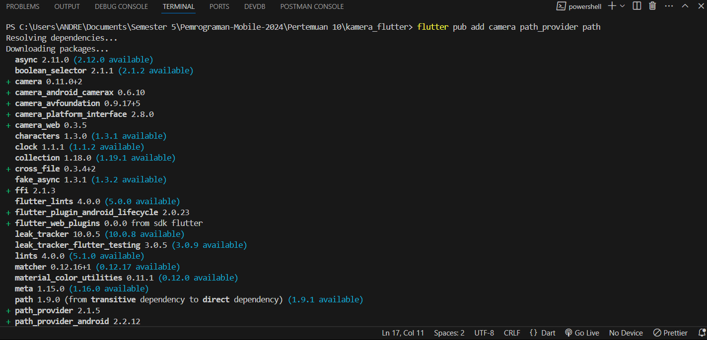

### Langkah 3: Ambil Sensor Kamera dari device

Selanjutnya, kita perlu mengecek jumlah kamera yang tersedia pada perangkat menggunakan plugin camera seperti pada kode berikut ini. Kode ini letakkan dalam void main().


**lib/main.dart**
```dart
Future<void> main() async {
  ...
}
```

### Langkah 4: Buat dan inisialisasi CameraController

Setelah Anda dapat mengakses kamera, gunakan langkah-langkah berikut untuk membuat dan menginisialisasi CameraController. Pada langkah berikut ini, Anda akan membuat koneksi ke kamera perangkat yang memungkinkan Anda untuk mengontrol kamera dan menampilkan pratinjau umpan kamera.

1. Buat StatefulWidget dengan kelas State pendamping.
2. Tambahkan variabel ke kelas State untuk menyimpan CameraController.
3. Tambahkan variabel ke kelas State untuk menyimpan Future yang dikembalikan dari CameraController.initialize().
4. Buat dan inisialisasi controller dalam metode initState().
5. Hapus controller dalam metode dispose().

**lib/widget/takepicture_screen.dart**

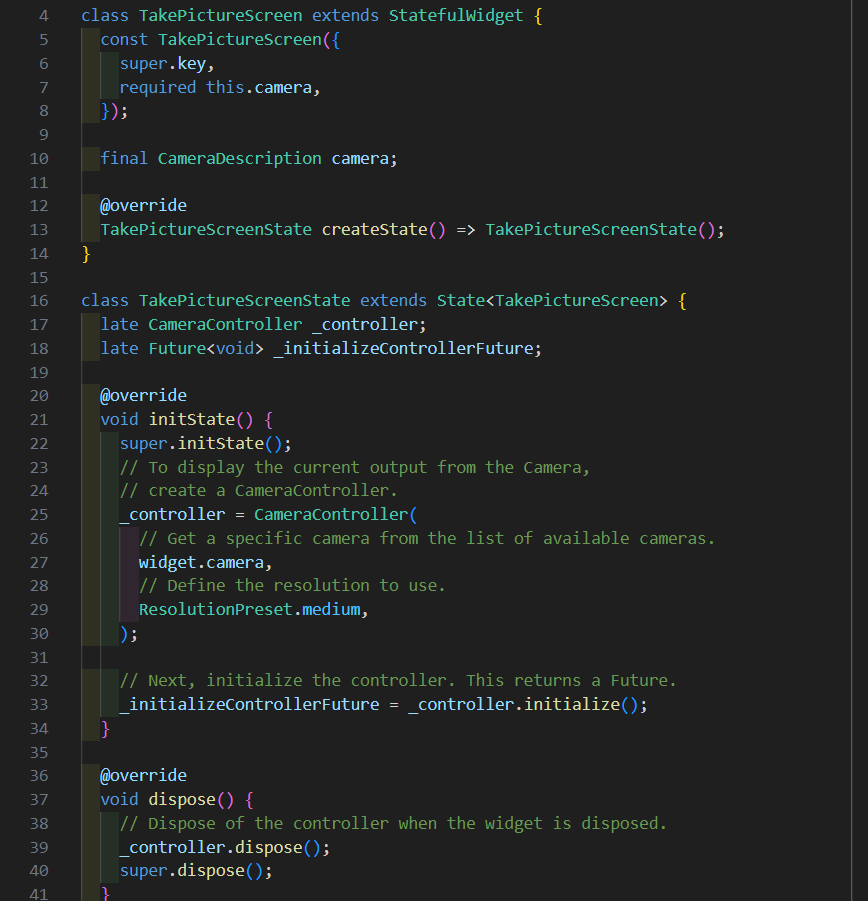


### Langkah 5: Gunakan CameraPreview untuk menampilkan preview foto
Gunakan widget CameraPreview dari package camera untuk menampilkan preview foto. Anda perlu tipe objek void berupa FutureBuilder untuk menangani proses async.

**lib/widget/takepicture_screen.dart**

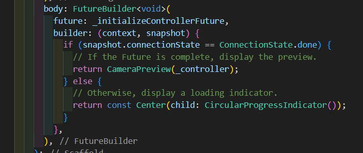

### Langkah 6: Ambil foto dengan CameraController
Anda dapat menggunakan CameraController untuk mengambil gambar menggunakan metode takePicture(), yang mengembalikan objek XFile, merupakan sebuah objek abstraksi File lintas platform yang disederhanakan. Pada Android dan iOS, gambar baru disimpan dalam direktori cache masing-masing, dan path ke lokasi tersebut dikembalikan dalam XFile.

Pada codelab ini, buatlah sebuah FloatingActionButton yang digunakan untuk mengambil gambar menggunakan CameraController saat pengguna mengetuk tombol.

Pengambilan gambar memerlukan 2 langkah:

1. Pastikan kamera telah diinisialisasi.
2. Gunakan controller untuk mengambil gambar dan pastikan ia mengembalikan objek Future.
Praktik baik untuk membungkus operasi kode ini dalam blok try / catch guna menangani berbagai kesalahan yang mungkin terjadi.

Kode berikut letakkan dalam Widget build setelah field body.

**lib/widget/takepicture_screen.dart**

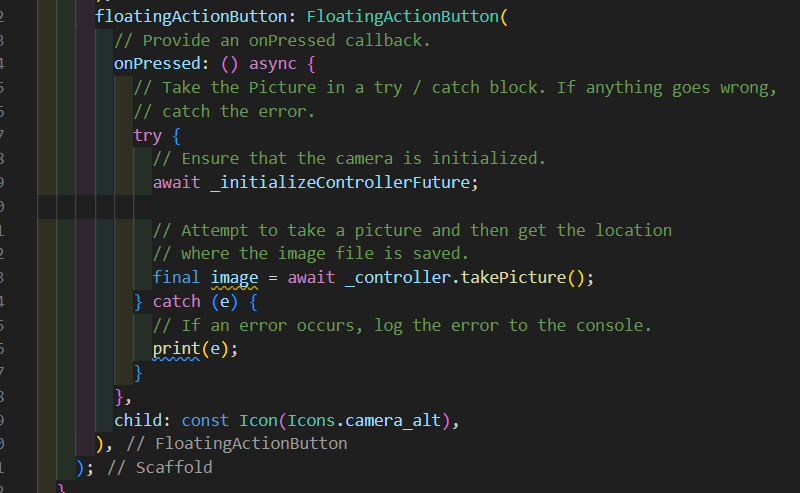

### Langkah 7: Buat widget baru DisplayPictureScreen
Buatlah file baru pada folder widget yang berisi kode berikut.

**lib/widget/displaypicture_screen.dart**

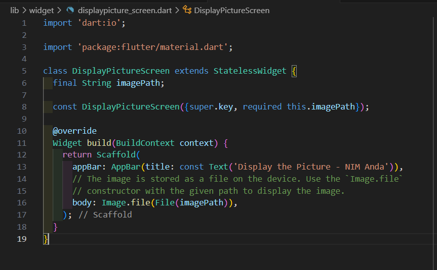


### Langkah 8: Edit main.dart
Edit pada file ini bagian runApp seperti kode berikut.

**lib/main.dart**

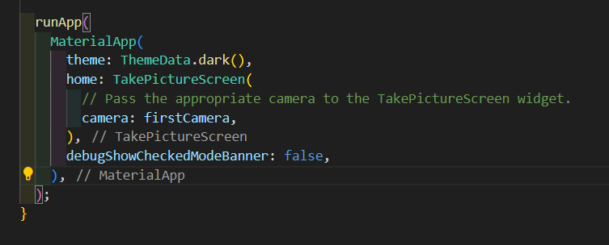

### Langkah 9: Menampilkan hasil foto
Tambahkan kode seperti berikut pada bagian try / catch agar dapat menampilkan hasil foto pada DisplayPictureScreen.

**lib/widget/takepicture_screen.dart**

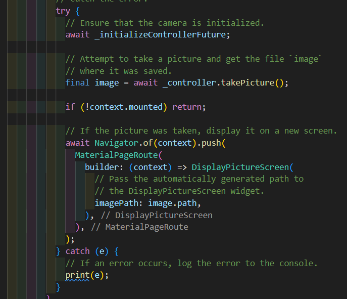


## Praktikum 2: Membuat photo filter carousel

### Hasil : 


### Langkah 1: Buat project baru
Buatlah project flutter baru di pertemuan 09 dengan nama photo_filter_carousel

### Langkah 2: Buat widget Selector ring dan dark gradient
Buatlah folder widget dan file baru yang berisi kode berikut.

**lib/widget/filter_selector.dart**

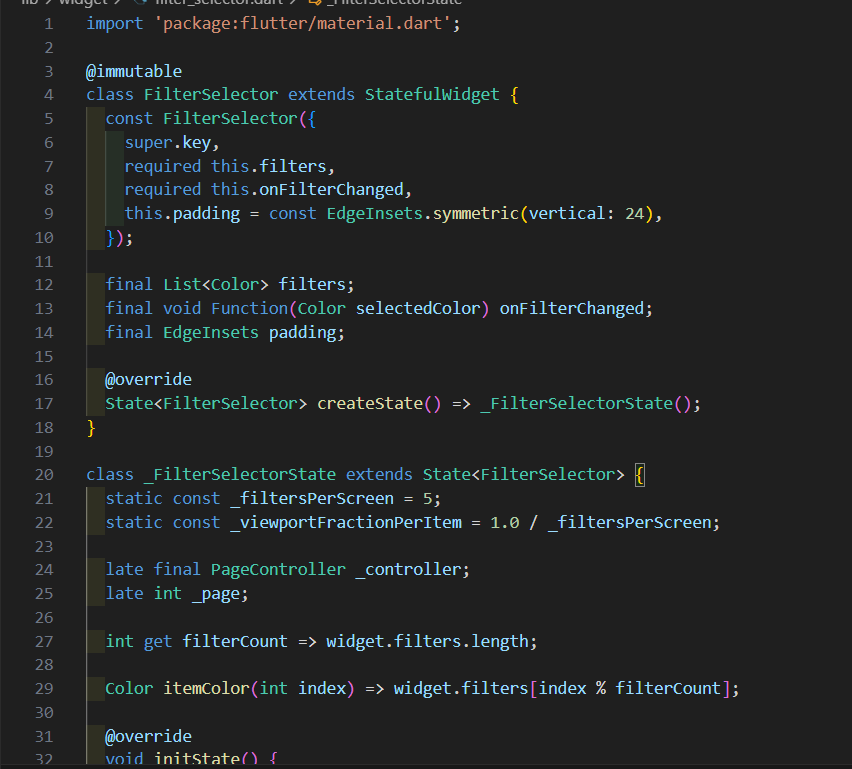

### Langkah 3: Buat widget photo filter carousel
Buat file baru di folder widget dengan kode seperti berikut.

**lib/widget/filter_carousel.dart**

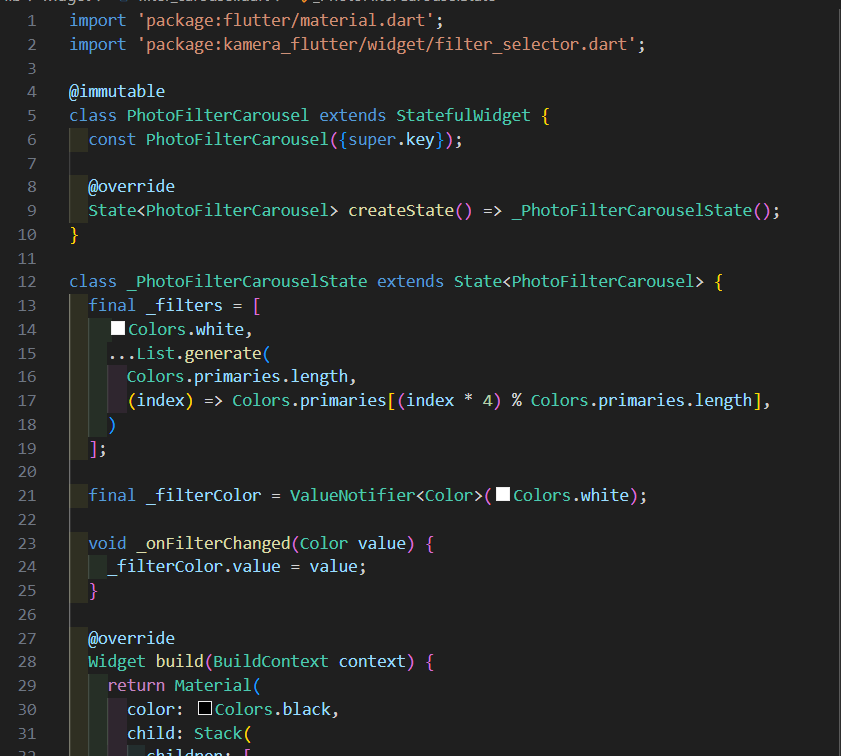

### Langkah 4: Membuat filter warna - bagian 1
Buat file baru di folder widget seperti kode berikut.

**lib/widget/carousel_flowdelegate.dart**

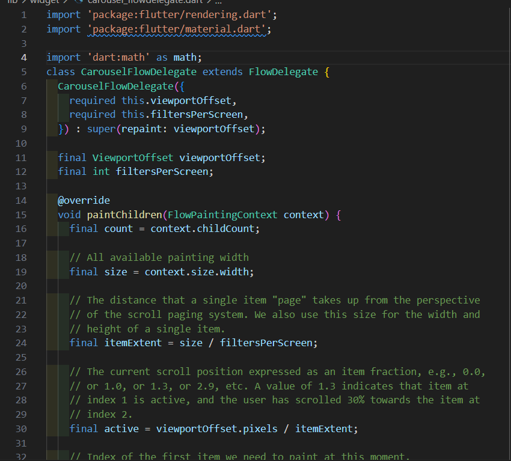

### Langkah 5: Membuat filter warna
Buat file baru di folder widget seperti kode berikut ini.

**lib/widget/filter_item.dart**

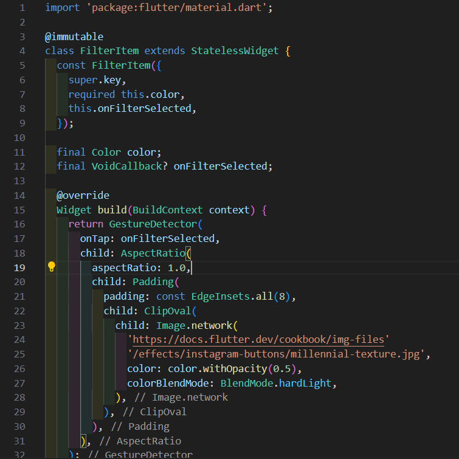

### Langkah 6: Implementasi filter carousel
Terakhir, kita impor widget PhotoFilterCarousel ke main seperti kode berikut ini.

**lib/main.dart**

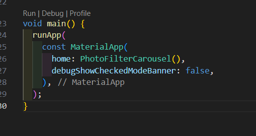

## Tugas 

### 1. Selesaikan Praktikum 1 dan 2, lalu dokumentasikan dan push ke repository Anda berupa screenshot setiap hasil pekerjaan beserta penjelasannya di file README.md! Jika terdapat error atau kode yang tidak dapat berjalan, silakan Anda perbaiki sesuai tujuan aplikasi dibuat!

### 2. Gabungkan hasil praktikum 1 dengan hasil praktikum 2 sehingga setelah melakukan pengambilan foto, dapat dibuat filter carouselnya!

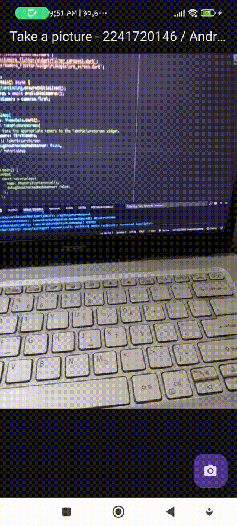


### 3. Jelaskan maksud void async pada praktikum 1?
`async` membuat main menjadi fungsi asinkron, yang memungkinkan untuk menjalankan operasi yang butuh waktu (seperti menunggu data dari internet) tanpa menghentikan seluruh program.

### 4. Jelaskan fungsi dari anotasi @immutable dan @override ?

- `@immutable` memastikan bahwa objek yang diciptakan dari kelas tersebut tidak akan berubah setelah dibuat. Ini berguna untuk mencegah perubahan tidak disengaja dan meningkatkan keandalan kode, terutama saat bekerja dengan widgets di Flutter.

- `@override` digunakan untuk menandai bahwa sebuah metode (atau properti) di dalam kelas subclass sedang menimpa (override) implementasi dari superclass-nya.